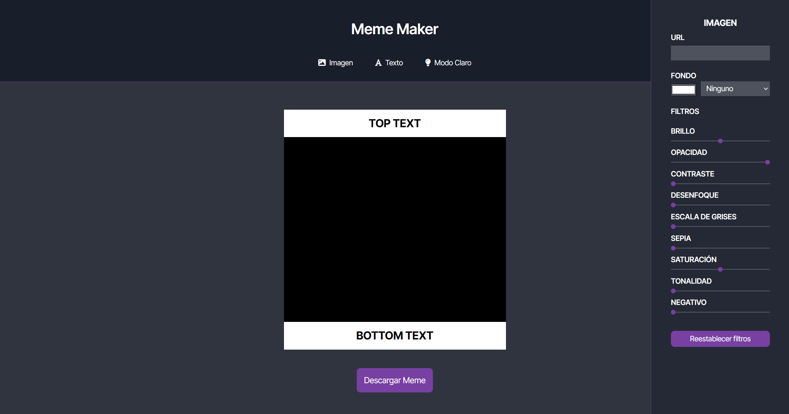

<h1>Meme Maker</h1>
<h3>Proyecto de Nerea Battauz Curso Frontend de ADA ITW </h3>
  

El proyecto consiste en la construcción de una página web para crear memes a partir de HTML, CSS y JavaScript.
El mismo permite editar tanto el texto como la imagen del meme a través de diferentes inputs, y descargarlo una vez que esté listo.
Asimismo, contienen un botón de modo oscuro/modo claro para distintas visualizaciones.

